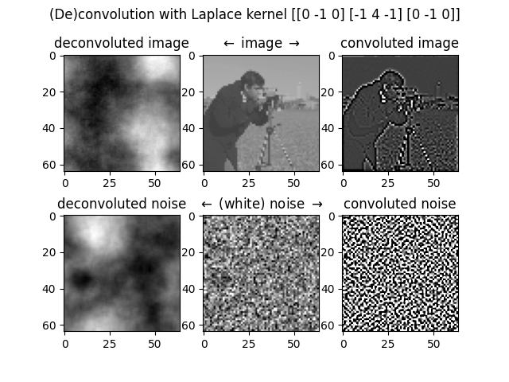

# small_projects
Random one-file self-contained projects that don't deserve own repo.

## hamming.py
Miniman working example of Hamming error correction. It can fix one bit flip errors and it can alert (but not fix) two bit flip erros. It is mathematically optimal solution for single bit flip errors. But most importantly it is damn simple and beautiful algorithm! For elegant and intuitive description, see [this YouTube video](https://www.youtube.com/watch?v=b3NxrZOu_CE).

## wavelets.py
Minimal working example of image compression with wavelet decomposotion. Unlike Fourier thansform, wavelets preserve locality both in spatial and frequency domains. That is, wavelets are mathematically rigorous version of spectrogram. The algorithm is home brew, and it is _very_ basic. It basically drops out the weakest 85% of local frequencies. While only the 15% of the wavelets are preserved, it is no where near packing the image to 15% of the original size due to sloppy bit packing.

## laplace_noise.py
Generates cloud-like noise texture using deconvolution of Laplace kernel. This is an interesting phenomenon, as Laplace kernel is almost like a sharpen-kernel, but it normalizes to 0 instead of 1. So we get cloud texture by inversely applying edge detection. What? Why? By intuition I would have predicted that somewhat-desharpening results somewhat-blurring. By the way, this is highly inefficient way to generate cloud texture, as it uses linear equation solver, which has complexity of O(n³), where n is total number of pixels in the image.

## quines
Quine is a program that prints its source code, without reading it from the source-file. It is a nice challenge/puzzle, as one must use some tricks to make source code match the printed output. The `quines`-directory contains few Rust and Python implementations that I have written from scratch over the years.

## random_path.py
An algorithm I came by to draw a random path between two points. This generates a fractal curve that looks a bit like electric shock. I made this algorithm for terrain generation of my friend's game, where he was looking for ways to generate roads and paths in the forest. The algorithm is based on mid-point algorithm, which is used our research group's (path integral) quantum simulation software.

